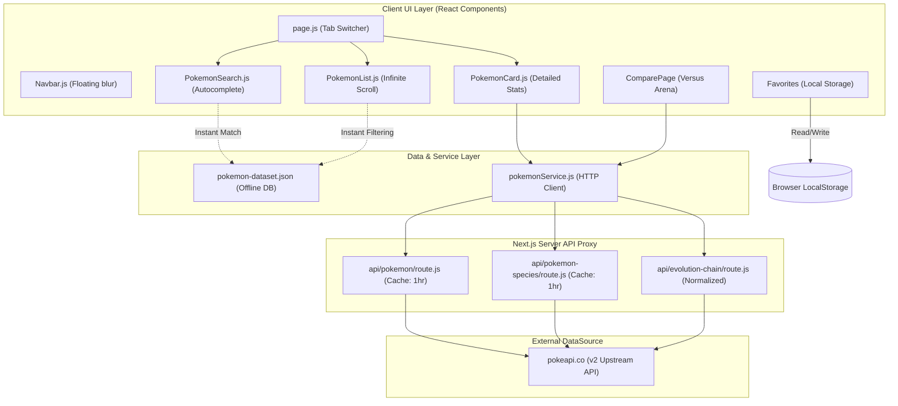

# Pokédex Codebase Analysis & Architecture Guide

Welcome to the comprehensive technical documentation for the **Pokédex** web application (also internally named **Pokedesk**). This document outlines the codebase's directory structure, architectural layers, data flow patterns, component responsibilities, key features, and visual design implementation.

---

## 🗺️ Architectural Overview

The application is built on top of the **Next.js (App Router)** framework using **React 19**, styled natively with **Tailwind CSS v4** and styled icons from `react-icons`. It is architected around a client-first responsive layout with server-side API proxy route handling to manage caching, normalization, and external PokeAPI requests.

### 🏗️ High-Level Architecture Flow

The following Mermaid diagram maps the flow of data and dependencies from external APIs to UI components:



---

## 📂 File Directory Structure

Here is a breakdown of the repository's main files and directories under `src/`:

```
a:/Development/pokedex/pokedesk/src/
├── app/
│   ├── about/
│   │   └── page.js               # Explains tech stack & project goals
│   ├── api/
│   │   ├── evolution-chain/
│   │   │   └── route.js          # API route to fetch & flatten evolution paths
│   │   ├── pokemon/
│   │   │   └── route.js          # API proxy route for Pokemon lists & details
│   │   └── pokemon-species/
│   │       └── route.js          # API proxy route for Legendary/Mythical & descriptions
│   ├── compare/
│   │   └── page.js               # Versus Arena comparing stats of 2 Pokémon side-by-side
│   ├── favorites/
│   │   └── page.js               # Saved favorite list retrieved from LocalStorage
│   ├── error.js                  # Global error handling page
│   ├── globals.css               # Tailwind directives and customized animations
│   ├── layout.js                 # Global HTML shell, SEO Meta tags, & Navbar integration
│   └── page.js                   # Primary Home Controller (handles Search vs Browse tabs)
├── components/
│   ├── BackgroundCarousel.js     # Glowing moving visual blobs background
│   ├── ChooseYouOverlay.js       # Action flash notification during search loading
│   ├── ErrorBoundary.js          # Client component error catcher
│   ├── EvolutionChain.js         # Renders the sequential evolutionary line
│   ├── FavoriteButton.js         # Contextual star button managing LocalStorage state
│   ├── FiltersSidebar.js         # Multiselect filter panel (type, generation, BST, ability)
│   ├── Navbar.js                 # Floating glassmorphic top navigation bar
│   ├── PokeLoader.js             # High-fidelity loading animation spinner
│   ├── PokeThrowOverlay.js       # Animated Pokeball capture simulation SVG
│   ├── PokemonCard.js            # Premium detail panel (HP/Attack visual meters, breeding)
│   ├── PokemonList.js            # Infinite scroll card grid utilizing type themes
│   ├── PokemonSearch.js          # Autocomplete search with key-down support
│   └── ProfileCard.js            # Extra UI card template
├── data/
│   └── pokemon-dataset.json      # Offline dataset (~620KB) containing stats & descriptors
└── services/
    └── pokemonService.js         # Core fetching logic & client name normalization
```

---

## 🧩 Deep-Dive into Component & Service Mechanics

### 1. The Core Data Hub: `pokemonService.js`
This module handles all communications to local server proxy paths. It ensures that inputs are rigorously sanitized on the client and server side.
- **Normalization Logic (`normalizeNameOrId`)**: Converts spaces or underscores to hyphens, maps symbols like `♀`/`♂` to `-f`/$-m$, removes apostrophes, and formats all queries to lowercase to prevent upstream PokeAPI mismatches.
- **Client Fallback Optimization**: If the local API routes return 404, it defaults to querying `"ditto"` as a safety measure.
- **Enriched List Results**: Rather than simply showing list names, `getPokemonList()` performs concurrent fetches for each item's details and species metadata to attach tags (`is_legendary`, `is_mythical`).

### 2. Next.js API Routes (Server-Side Performance Proxies)
To keep client bundle sizes low, minimize network calls, and ensure security, calls are proxied through Next.js edge-like routes:
- **`api/pokemon/route.js`**: Retrieves Pokemon details. Returns a custom header:
  `Cache-Control: public, s-maxage=3600, stale-while-revalidate=60`
  This caches upstream responses for 1 hour while executing an asynchronous background update if the cache is stale.
- **`api/pokemon-species/route.js`**: Feeds descriptions, habitats, capture rates, and growth properties.
- **`api/evolution-chain/route.js`**: Orchestrates deep hierarchical traversal. Upstream PokeAPI returns complex recursive trees of evolutions. This endpoint flattens the tree into a clean linear progression array:
  ```json
  [
    { "name": "bulbasaur", "id": 1, "stage": 1 },
    { "name": "ivysaur", "id": 2, "stage": 2 },
    { "name": "venusaur", "id": 3, "stage": 3 }
  ]
  ```

### 3. Autocomplete Search: `PokemonSearch.js`
- Loads `pokemon-dataset.json` once to compile an offline index of names.
- Filters instantly on keystroke by matching prefix starts (`startsWith`) followed by substring containment (`includes`).
- Supports fully accessible keyboard navigability: `ArrowDown`/`ArrowUp` shifts active index highlighting, `Enter` executes search, and `Escape` dismisses the floating tray.

### 4. Interactive List & Sidebar System: `PokemonList.js` & `FiltersSidebar.js`
- **Dynamic Type Aesthetics**: Integrates a rich mapping dictionary defining colors and glow configurations for all 18 Pokémon types:
  ```javascript
  fire: {
    gradient: 'from-orange-500/20 to-red-600/20 border-orange-400/40 dark:border-orange-600/40',
    badge: 'bg-orange-500 text-white',
    glow: 'shadow-orange-500/10 hover:shadow-orange-500/30'
  }
  ```
- **Instant Client-Side Filtering**: Filters the full set of entries in a React `useMemo` instantly by:
  - Multi-select types
  - Generation categories (Gens 1 to 9)
  - Base Stat Total (BST range inputs)
  - Text-matching abilities
  - Sub-type classifications (Legendary, Mythical, Pseudo-legendary, Fossils)
- **High-Performance Infinite Scrolling**: Instead of rendering all matching rows concurrently (which causes rendering lag), the system mounts an `IntersectionObserver` sentinel element. The page renders chunks of 24 items initially, expanding dynamically by batches of 12 as the user approaches the bottom.

### 5. Versus Arena: `ComparePage` (Compare)
The comparison engine is located inside `src/app/compare/page.js`.
- Allows users to select two separate entities and compare their combat statistics.
- Validates selection rules (e.g. blocking comparing a Pokémon with itself).
- **Stat Battle Breakdown**: Calculates a visual balance bar where green signifies the winner, red denotes the lower value, and a crown `👑` emoji dynamically renders next to the higher stat.
- **Base Stat Total (BST)** compares raw power, while individual meters measure Attack, Defense, HP, Speed, Special Attack, and Special Defense side-by-side.

---

## 🎨 Visual Design System & Aesthetics

The application achieves a highly premium, modern, "wow" aesthetic using key design principles:

1. **Glowmorphism & Mesh Gradients**:
   The `BackgroundCarousel.js` uses four large, differently colored, highly-blurred background blobs executing keyframe animations (`animate-blob`) that float continuously. Coupled with glassmorphic panels and a faint grid layout, it creates a sleek modern interface.
2. **Smooth Transitions**:
   Includes micro-animations such as scaling on button hover, loading pulses, and fade-in entries (`animate-fade-in`).
3. **Responsive Drawers**:
   On mobile viewports, the side control panel shifts into an off-canvas slide-out drawer, conserving high-value visual real estate.
4. **Dark Mode Integration**:
   Includes Tailwind classes prefixed with `dark:` ensuring perfect dark contrast ratios for nighttime usage.

---

## 📜 Key Data Schemas

### Local Storage Favorites Structure
Stored as stringified JSON under the key `'pokemonFavorites'`:
```typescript
interface FavoriteItem {
  id: number;
  name: string;
  sprite: string;
  types: string[];
}
```

### Flattened Evolution Tree Structure
```typescript
interface EvolutionNode {
  name: string;
  id: number | null;
  stage: number;
}
```

---

## 🔮 Next Steps & Scaling Suggestions

If you choose to expand this project further, here are some high-value additions:
1. **Detailed Move Properties**: Expand moves beyond list tags to display base damage power, categories (Special, Physical, Status), and accuracy percentages.
2. **Catch Rate Simulator**: Use the capture rate stored in `breedingInfo` to build an interactive minigame where users throw Pokeballs to simulate catch odds!
3. **Type Matchup Calculator**: Leverage the active type badges to display double-damage resistances and weaknesses in a simplified visual grid.
